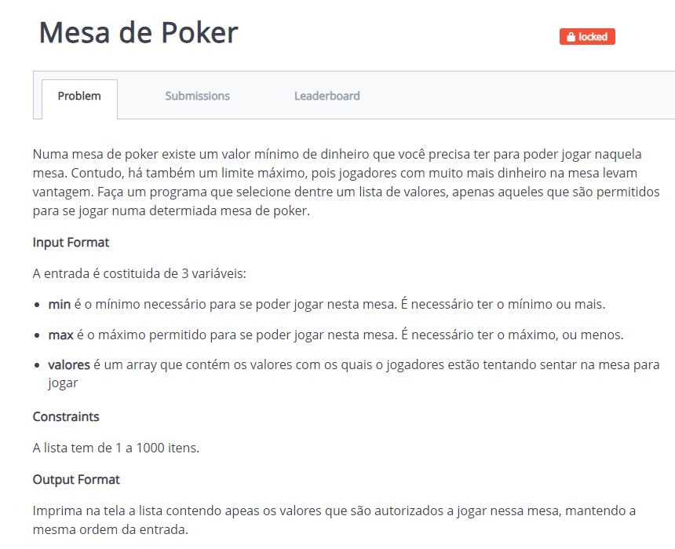
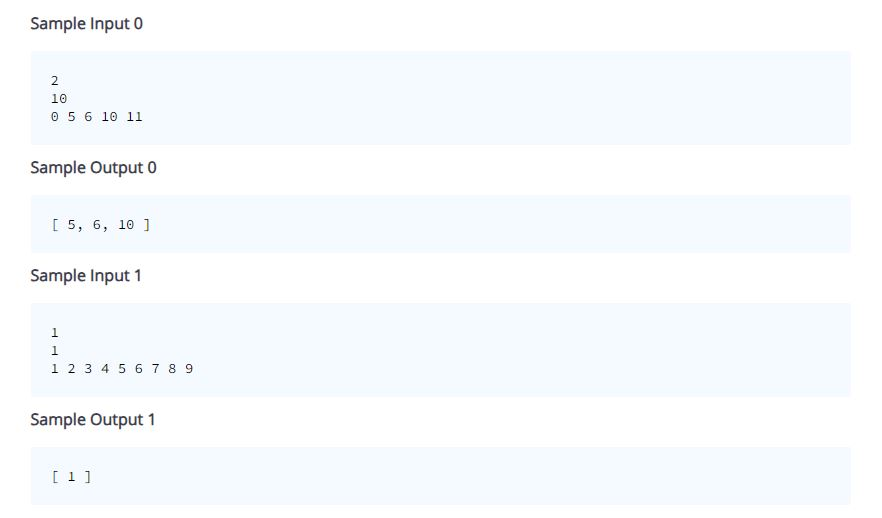
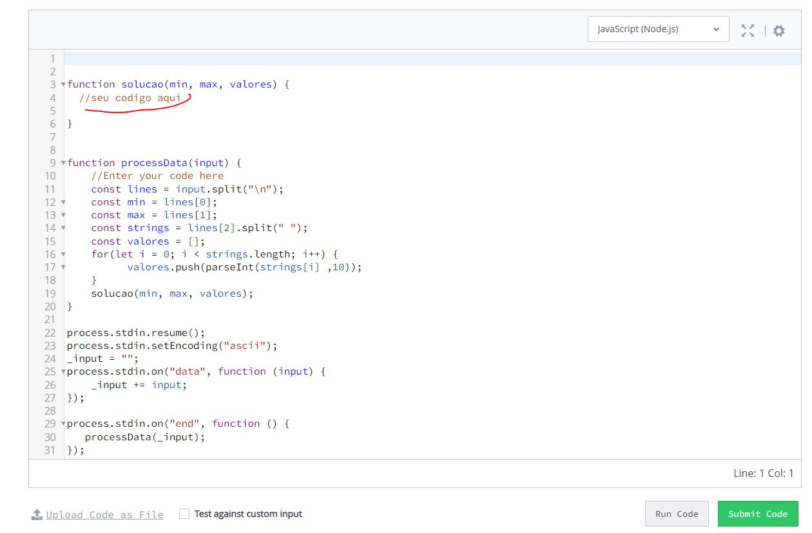
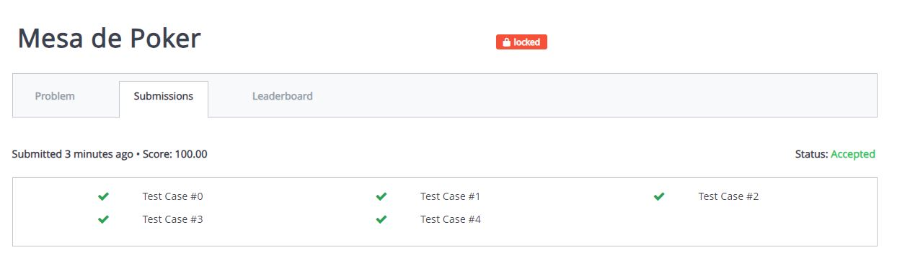

# Desafio do Módulo 1 na @CubosAcademy

Este desafio consistia em resolver problemas no site da [hackerrank](https://www.hackerrank.com/) utilizando o conhecimento adquirindo durante todo o módulo. A ferramente utilizada neste desafio foi o Visual Studio Code e Javascript como linguagem.

Como critério de aprovação neste módulo, o próprio site da hakerrank realizava diversos testes com diversos tipos de entradas.

exemplo: Mesa de Poker

É dado o comando, quais entradas e saídas o scrip devia possuir

O código era adicionado neste trecho em destaque

Após submeter o site gerava algumas entradas como testes, e se passasse em todos os teste a tarefa era concluída.

